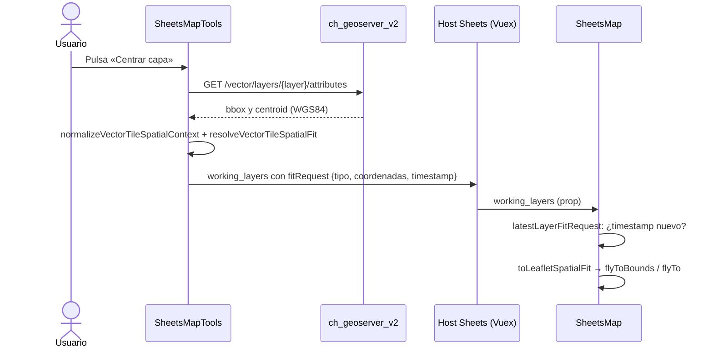

# Centrar capa para Vector Tiles

Historia: [AGCID01-31](https://coderhub.atlassian.net/browse/AGCID01-31).

Cada capa Vector Tiles del control de capas muestra el botón **Centrar capa**. Al pulsarlo, el mapa principal ajusta centro y zoom para encuadrar la **extensión completa del dataset**, no los tiles cargados ni la vista actual. La acción no activa ni desactiva la capa, no inicia descargas y no altera simbología, opacidad ni filtros.

## Resultado funcional

- Las acciones de la fila quedan en este orden: **Centrar capa → Descargar capa → Configurar capa**. Centrar no depende de que exista `download_url`.
- El botón es un `<button>` con `aria-label="Centrar capa <nombre>"` y tooltip; se activa con clic, `Enter` o `Espacio`.
- Mientras consulta la extensión, el ícono cambia a un indicador giratorio y el botón queda deshabilitado.
- Si la capa no informa extensión o la consulta falla, el mapa conserva la vista y la fila muestra el motivo en rojo.
- Funciona igual en las dos presentaciones del control: opción suelta y opción dentro de un subgrupo.

| Contexto espacial de la capa | Encuadre en el mapa principal |
| --- | --- |
| `bbox` con área | `flyToBounds` con margen de 64 px y zoom máximo 15, acotado por los límites del mapa. |
| `bbox` degenerado (un punto) | `flyTo` al punto con zoom 15. |
| Solo `centroid` | `flyTo` al centroide con zoom 12. |
| Sin `bbox` ni `centroid` | Sin movimiento. Mensaje: «La capa no informa su extensión; se conserva la vista actual.» |
| Error de consulta | Sin movimiento. Mensaje: «No fue posible obtener la extensión de la capa.» |

Todos los zooms pasan por `clampMapZoom`, por lo que respetan `minZoom` y `maxZoom` configurados.

## Origen de la extensión

La extensión se lee de `GET /vector/layers/{layer_name}/attributes`, que en `ch_geoserver_v2` devuelve `bbox` y `centroid` en WGS84 calculados con `ST_Extent` sobre la capa completa. La consulta usa la misma autenticación que el modal de configuración (`requestAuthForLayer`), por lo que funciona con los permisos vigentes del usuario sin descargar entidades.

```json
{
  "layer_name": "layer_4_1_10_2_eod_gran_concepcion_2015_macrozonas",
  "attributes": ["id_macroz", "macrozona", "shape_leng"],
  "bbox": [-73.1896, -37.1272, -72.9047, -36.5197],
  "centroid": [-73.0472, -36.8235]
}
```

El `bbox` llega en orden longitud/latitud. Leaflet espera latitud/longitud; la conversión vive en `toLeafletSpatialFit`.

## Arquitectura



| Pieza | Responsabilidad |
| --- | --- |
| `SheetsMapTools.vue` · `centerLayer` | Consulta la extensión, resuelve el encuadre, gestiona carga y errores por capa y publica `fitRequest` en `working_layers`. |
| `SheetsMap.vue` · `watch working_layers` | Atiende una sola vez cada `fitRequest` nuevo y llama a `fitLayerExtent`. |
| `vectorTileLegend/preview.js` · `resolveVectorTileSpatialFit` | Decide el tipo de encuadre (extensión, punto o centroide) en lon/lat. La comparte la vista previa del modal. |
| `vectorTileLegend/preview.js` · `toLeafletSpatialFit` | Traduce el encuadre a lat/lon y asigna el zoom de punto o centroide. |
| `vectorTileLegend/preview.js` · `latestLayerFitRequest` | Elige el pedido más reciente entre las capas. |

### Por qué `working_layers` y no un evento

`SheetsMapTools` y `SheetsMap` no se comunican directamente: el host Sheets lee `working_layers` de las herramientas y lo entrega al mapa por Vuex. Publicar el pedido en ese canal evita modificar el host. El costo es que un pedido puntual viaja como estado; por eso cada `fitRequest` lleva `timestamp` y `SheetsMap` guarda el último atendido (`handled_fit_request_timestamp`). Así, un cambio de opacidad o filtro no vuelve a centrar, y pulsar dos veces la misma capa sí lo hace.

## Cómo probar

Pruebas automatizadas (Node 22 no acepta el directorio en `--test`, por eso se listan los archivos):

```bash
node --experimental-default-type=module --test tests/*.test.js
```

Prueba manual en el Visor Maestro con la librería vinculada (ver [Vincular la librería local](configuracion-simbologia-vector-tiles.md#vincular-la-librería-local)):

1. Abrir el control de capas y desplegar **EOD Gran Concepción 2015**.
2. Desde una vista alejada, pulsar **Centrar capa** en **Macrozonas EOD Gran Concepción 2015**: el mapa encuadra Talcahuano, Concepción y Coronel y la capa sigue inactiva.
3. Repetir con **Puntos de Medición Vehicular Periódicas Curicó** usando `Tab` y `Enter`.
4. Repetir con **Red Nacional de Ciclovías (diciembre 2025)** para líneas.

## Limitaciones conocidas

- **Capas nacionales con territorio insular.** Si el `bbox` incluye Rapa Nui (por ejemplo, la red nacional de ciclovías llega a longitud −109.4), el encuadre completo queda mayormente sobre el océano. Es el comportamiento pedido («extensión completa del dataset»); recortar a Chile continental requeriría una regla de negocio explícita.
- **Panel de capas abierto.** El margen de 64 px no considera el ancho del panel de capas, que puede cubrir parte del encuadre.
- **Capas restringidas.** El flujo usa la autenticación existente, pero no se validó en vivo porque el entorno local no tiene capas con `requires_bearer`.
