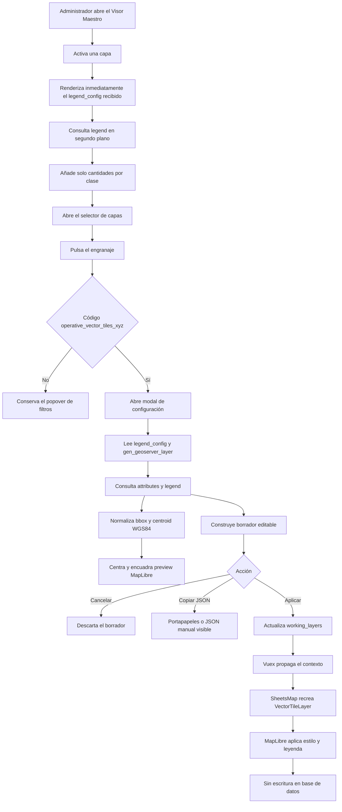

# Configuración temporal de simbología para Vector Tiles XYZ

Esta capacidad permite que un administrador configure filtros, transparencia y simbología de una capa `operative_vector_tiles_xyz` desde el Visor Maestro. El cambio se aplica inmediatamente al mapa abierto y puede copiarse como JSON, pero **no escribe en la base de datos**. Para hacerlo permanente, el JSON debe guardarse posteriormente en `legend_config` mediante el flujo administrativo correspondiente.

## Resultado funcional

El engranaje de una capa Vector Tiles XYZ abre un modal responsive con dos pestañas:

1. **Simbología y leyenda**, que permite elegir simbología simple o temática, editar su representación y revisar una vista previa cartográfica en vivo.
2. **Filtros**, que conserva las capacidades previas de transparencia y filtrado; el control de transparencia ocupa una columna y, en la fila siguiente, el atributo queda alineado junto al valor del filtro.

El editor usa tarjetas, espaciado y alineación uniformes; ubica los interruptores al final de cada grupo, presenta muestras visuales para línea continua, segmentada y punteada, y mantiene visibles los selectores de relleno y borde de cada clase. Las clases se presentan como pestañas horizontales con color identificador y controles anterior/siguiente, de modo que solo se edita una a la vez y no se genera una página excesivamente larga. Las flechas usan íconos SVG centrados, se muestran grises en reposo y cambian a azul con hover o foco; conservan `aria-label` para accesibilidad, pero no usan `title` ni muestran texto emergente nativo. Cuando no existe otra clase en una dirección, el botón permanece inactivo sin mostrar un cursor de bloqueo. Cuando existe un atributo seleccionado, la tarjeta de clases conserva el encabezado **Estilo de la geometría**, ocupa el lugar del bloque general antes de **Leyenda** y comunica que los controles pertenecen a la simbología específica. Mientras se obtiene la clasificación, la tarjeta reserva un espacio en blanco sin controles ni indicadores visuales; así **Leyenda** no sube ni aparece fugazmente antes de las clases. La etiqueta se edita primero, sin subsección, y los controles restantes se agrupan por **Relleno**, **Borde**, **Marcador**, **Línea del borde** o **Línea**, según la geometría. La vista previa permanece alineada con el inicio del primer recuadro de configuración y fija en la parte superior de su columna durante el desplazamiento. La leyenda y la altura del mapa se ajustan al viewport para no depender del zoom del navegador.

La edición admite:

- Color principal, color de borde y opacidades.
- Borde habilitado o deshabilitado, anchos y trazo continuo, segmentado o punteado para polígonos, líneas y marcadores de puntos.
- Título, descripción y visibilidad de la leyenda.
- Título inicial tomado del nombre visible de la capa, evitando que **Copiar JSON** quede bloqueado por un dato que ya existe en el visor.
- Clases categóricas, rangos numéricos y clase de texto de alta cardinalidad.
- Nombre y configuración completa por clase: colores, opacidades, bordes, trazos y símbolos.
- Formas `circle`, `square`, `triangle` y `diamond` para puntos.
- Tamaño y borde de puntos.
- Color y visibilidad de elementos sin clasificación.
- Copia determinista del `legend_config` como JSON.

## Alcance y precondiciones

| Tema | Comportamiento |
| --- | --- |
| Tipo habilitado | Solo capas con código `operative_vector_tiles_xyz`. |
| Visor habilitado | En la instalación local actual, este tipo reservado solo está configurado en el Visor Maestro. |
| Permisos | Los administra el host Sheets. `sheets_map` no decide si el usuario es administrador. |
| Contexto inicial | Se toma de `sh_map_has_layer_legend_config`, alias de `legend_config`. |
| Nombre de capa | Se toma de `sh_map_has_layer_geoserver_layer`, alias de `gen_geoserver_layer`; la URL es respaldo. |
| Persistencia | No hay `POST`, `PUT`, `PATCH`, `DELETE` ni mutación de base de datos. |
| Permanencia | El usuario copia el JSON y lo pega manualmente en `legend_config` mediante el flujo autorizado. |

> **Precondición importante:** la librería no recibe hoy una identidad del visor ni una prop de capability. El alcance exclusivo al Visor Maestro depende de que `operative_vector_tiles_xyz` continúe reservado a ese visor. Si el tipo se reutiliza, el host deberá enviar una capability explícita. No se debe resolver este punto con un UUID de visor hardcodeado.

## Flujo funcional



## Arquitectura de la solución

### Componentes

| Componente | Responsabilidad |
| --- | --- |
| `SheetsMapTools.vue` | Detecta capas elegibles, abre el modal y conserva la configuración temporal por capa. |
| `VectorTileLayerSettingsModal.vue` | Coordina carga, cancelación de solicitudes, validación, aplicación y copia de JSON. |
| `VectorTileSymbologyEditor.vue` | Renderiza los controles de simbología y emite borradores inmutables. |
| `VectorTileSymbologyPreview.vue` | Encuadra la extensión de la capa en MapLibre, centra la cámara y reutiliza la leyenda del visor. |
| `vectorTileAttributesService.js` | Construye y consulta el endpoint plural de atributos. |
| `vectorTileLegendService.js` | Construye y consulta el endpoint plural de leyenda, con atributo opcional. |
| `vectorTileLegend/editor.js` | Crea, valida y serializa el borrador con orden determinista. |
| `vectorTileLegend/config.js` | Normaliza configuraciones v2 y mantiene compatibilidad con claves anteriores. |
| `vectorTileLegend/style.js` | Traduce el contrato a expresiones MapLibre para polígonos, líneas y puntos. |
| `vectorTileLegend/preview.js` | Adapta el borrador al render state de producción, normaliza `bbox`/`centroid` y crea una capa por tipo geométrico. |
| `VectorTileLayer.vue` | Aplica URL filtrada, estilos, símbolos y actualización de leyenda en runtime. |
| `VectorTileLegend.vue` | Presenta título, descripción, clases y trazo de línea. |
| `clipboard.js` | Implementa Clipboard API, timeout, fallback con `textarea` y resultado accesible. |

### Canal temporal de actualización

La aplicación sigue este canal verificado:

```text
working_layers → Vuex → SheetsMap → VectorTileLayer → MapLibre
```

`SheetsMapTools` conserva `runtimeLegendConfigs` y un `legendRevision` por capa. `SheetsMap` combina ese borrador con la capa renderizable y actualiza su identidad de render. Al activar una capa, `VectorTileLayer` normaliza el JSON ya recibido en `legend_config`, aplica el estilo y emite inmediatamente la leyenda persistida. En el siguiente ciclo de render consulta `/legend?attribute=...` en segundo plano y combina únicamente los conteos con los elementos ya visibles; no reemplaza colores, etiquetas ni estructura. Las solicitudes anteriores se abortan o descartan mediante identificadores para evitar condiciones de carrera.

Cerrar o cancelar el modal no emite `apply`, por lo que el mapa conserva la configuración anterior.

> **Regla de carga progresiva:** la leyenda nunca espera al servicio para aparecer. El `GET /legend?attribute=...` comienza después del primer render y solo añade cantidades entre paréntesis. Si la solicitud falla, se cancela o devuelve otro atributo, la leyenda existente permanece sin cambios y no se emite un estado vacío intermedio. Las simbologías simples no realizan esta consulta.

## Integración con el servicio vectorial

### Derivación de URL

La base se deriva de la URL de tiles configurada en la capa. No se fija un host en la librería. A partir de una URL con forma:

```text
/vector/tiles/{layer_name}/{z}/{x}/{y}.pbf
```

se construyen los endpoints:

```text
GET /vector/layers/{layer_name}/attributes
GET /vector/layers/{layer_name}/legend
GET /vector/layers/{layer_name}/legend?attribute={attribute}
```

Los endpoints usados por la implementación son plurales: `/vector/layers/...`.

### Atributos disponibles

Respuesta exitosa representativa:

```json
{
  "layer_name": "apc",
  "attributes": [
    "ciudad",
    "categoria",
    "valor"
  ],
  "bbox": [-75.644, -53.162, -67.395, -18.478],
  "centroid": [-71.5195, -35.82]
}
```

Si la capa no informa atributos, el servicio puede responder HTTP 200 con una colección vacía:

```json
{
  "layer_name": "capa_inexistente",
  "attributes": [],
  "bbox": null,
  "centroid": null
}
```

El modal muestra que no existen atributos disponibles y no permite aplicar una simbología temática incompleta. Al seleccionar un atributo, la consulta se ejecuta sin insertar un mensaje transitorio de carga que desplace el formulario; el selector queda bloqueado únicamente durante la solicitud y los errores sí se comunican de forma visible.

### Definición semántica

Respuesta categórica representativa:

```json
{
  "layer_name": "apc",
  "attribute": "ciudad",
  "legend_type": "categorical",
  "geometry_type": "Point",
  "classes": [
    {
      "key": "<valor_de_clase>",
      "label": "<etiqueta>",
      "count": 1
    }
  ],
  "null_count": 0,
  "sample_size": 10,
  "bbox": [-75.644, -53.162, -67.395, -18.478],
  "centroid": [-71.5195, -35.82]
}
```

En la validación integrada, la capa APC consultada por `ciudad` devolvió geometría `Point`, tipo `categorical` y 10 clases reales.

Respuesta numérica representativa:

```json
{
  "layer_name": "capa_lineal",
  "attribute": "valor",
  "legend_type": "numeric",
  "geometry_type": "LineString",
  "ranges": [
    {
      "min_value": 0,
      "max_value": 10,
      "label": "0 a 10",
      "count": 12
    }
  ],
  "null_count": 0,
  "bbox": [-71.4, -35.8, -70.7, -35.1],
  "centroid": [-71.05, -35.45]
}
```

`bbox` usa el orden `[minX, minY, maxX, maxY]` y `centroid` usa `[longitud, latitud]`; ambos se entregan en EPSG:4326. El centroide corresponde al centro estable de la envolvente y está pensado para inicializar cámaras cartográficas. Los campos son aditivos y no alteran `attributes`, `classes` ni `ranges`.

En `ch_geoserver_v2`, el repositorio prioriza el `bbox` WGS84 persistido en `catalog_layers`. Solo si el catálogo no tiene extensión ejecuta el cálculo exacto con `ST_Extent`; así las capas pesadas no recalculan su envolvente en cada apertura del modal.

### Errores observados del servicio

- Una capa inexistente en `legend` responde HTTP 404 con cuerpo de texto, no JSON.
- Un atributo inválido puede devolver la leyenda por defecto en vez de un error HTTP.
- El cliente exige que `attribute` coincida con el solicitado y que existan `classes`, `ranges` o una definición `text`. Si no coincide, muestra un error de segmentación y conserva el borrador anterior.

La siguiente estructura es una representación diagnóstica para documentación, no una respuesta JSON del endpoint 404:

```json
{
  "status": "error",
  "error_code": "VECTOR_LAYER_NOT_FOUND",
  "message": "El servicio de leyenda respondió HTTP 404 con un cuerpo de texto."
}
```

## Contrato `legend_config`

El editor serializa un objeto raíz `vector_tile_legend`, versión 2. Las claves se ordenan antes de convertirlas a texto para que dos copias del mismo borrador produzcan exactamente el mismo JSON.

### Campos principales

| Campo | Uso |
| --- | --- |
| `mode` | `manual` para simple; `semantic` para temática. |
| `layer_name` | Nombre de la capa publicado por el servicio vectorial. |
| `geometry_type` | Geometría obtenida desde `legend`. |
| `attribute` | Atributo temático; `null` en modo simple. |
| `palette.items` | Clase simple, categorías, texto o rangos editables. |
| `style` | Opacidades, borde, anchos y patrón de línea. |
| `point_style` | Forma, tamaño y ancho de borde por defecto. |
| `palette.items.*.style` | Overrides opcionales de opacidad, borde, ancho y patrón para una clase. |
| `palette.items.*.point` | Overrides opcionales de forma, tamaño y borde para una clase de puntos. |
| `visibility` | Visibilidad de leyenda y elementos sin clasificación. |

La normalización conserva compatibilidad con `colors` legacy y con la clave de texto anterior `__TEXT_FALLBACK__`.

### Ejemplo simple para polígono

```json
{
  "vector_tile_legend": {
    "attribute": null,
    "description": "Cobertura general",
    "enabled": true,
    "geometry_type": "Polygon",
    "layer_name": "cobertura",
    "legend_title": "Cobertura",
    "mode": "manual",
    "palette": {
      "fallback_color": "#4E79A7",
      "items": {
        "__SIMPLE__": {
          "fill": "#4E79A7",
          "label": "Cobertura",
          "point": {
            "shape": "circle",
            "size": 8,
            "stroke_width": 3
          },
          "stroke": "#2F4962"
        }
      },
      "name": "tableau10",
      "null_color": "#BDBDBD",
      "strategy": "manual",
      "type": "simple"
    },
    "point_style": {
      "shape": "circle",
      "size": 8,
      "stroke_width": 3
    },
    "ranges_continuous": false,
    "style": {
      "border_enabled": true,
      "dash_style": "solid",
      "fill_opacity": 0.6,
      "line_opacity": 0.85,
      "line_width": 2.5,
      "stroke_opacity": 0.8,
      "stroke_width": 2
    },
    "version": 2,
    "visibility": {
      "show_in_map_legend": true,
      "show_unclassified": true
    }
  }
}
```

En polígonos, el color y `fill_opacity` controlan el relleno; `border_enabled`, `stroke_width` y `stroke_opacity` controlan el borde.

Los inputs visuales aplican límites al escribir, no solo al usar las flechas: opacidades `0–1`, anchos de línea/borde `0–20`, tamaño de punto `1–64` y borde de punto `0–16`. El preview entra nuevamente por el serializador, normalizador y constructor de expresiones de producción, por lo que ancho, opacidad, colores y clases se actualizan en vivo con el mismo contrato del mapa principal.

El preview usa un mapa base raster y la fuente XYZ real. Inicializa la cámara con `centroid` y ejecuta `fitBounds` sobre `bbox`, de modo que capas nacionales o dispersas —como APC— aparecen centradas sin depender de que el sector inicial contenga elementos. MapLibre solicita únicamente los tiles visibles para ese encuadre y conserva una caché máxima de seis tiles; no descarga la tabla completa ni crea una capa por categoría. Para servicios antiguos que todavía no entreguen contexto espacial se mantiene, como degradación, el autoencuadre sobre un máximo de 200 features ya cargadas. Las expresiones `match` o `case` resuelven las clases en GPU y el preview observa el borrador más la respuesta semántica para aplicar colores y rangos al finalizar la selección. Los rangos numéricos conservan claves internas únicas aunque el servicio entregue etiquetas redondeadas iguales; así cada clase mantiene su propio estilo. Los valores nulos o fuera de los rangos usan el color **sin clasificación** y, si esa opción está desactivada, permanecen ocultos en vez de recuperar el azul general de la capa. El mapa y el bloque de leyenda usan separación inferior equivalente a sus márgenes laterales.

### Ejemplo categórico para puntos

```json
{
  "vector_tile_legend": {
    "attribute": "ciudad",
    "description": "Clasificación por ciudad",
    "enabled": true,
    "geometry_type": "Point",
    "layer_name": "apc",
    "legend_title": "APC por ciudad",
    "mode": "semantic",
    "palette": {
      "fallback_color": "#4E79A7",
      "items": {
        "<valor_de_clase>": {
          "fill": "#E15759",
          "label": "<nombre_visible>",
          "point": {
            "shape": "diamond",
            "size": 12,
            "stroke_width": 2
          },
          "stroke": "#8A3436",
          "style": {
            "border_enabled": true,
            "fill_opacity": 0.75,
            "stroke_opacity": 0.9
          }
        }
      },
      "name": "tableau10",
      "null_color": "#BDBDBD",
      "strategy": "manual",
      "type": "categorical"
    },
    "point_style": {
      "shape": "diamond",
      "size": 12,
      "stroke_width": 2
    },
    "ranges_continuous": false,
    "style": {
      "border_enabled": true,
      "dash_style": "solid",
      "fill_opacity": 0.6,
      "line_opacity": 0.85,
      "line_width": 2.5,
      "stroke_opacity": 0.8,
      "stroke_width": 2
    },
    "version": 2,
    "visibility": {
      "show_in_map_legend": true,
      "show_unclassified": true
    }
  }
}
```

En puntos, el tamaño inicial es `3`. **Estilo de la geometría** se organiza en subsecciones semánticas: **Relleno**, **Borde** y **Marcador** para puntos; **Línea del borde** para polígonos; o **Línea** para geometrías lineales. No existen tarjetas ni anchos de borde duplicados. Cada clase puede sobrescribir colores, opacidades, borde, forma y tamaño. Si la capa ya tiene `sh_map_has_layer_point_image`, ese ícono tiene prioridad y el editor deshabilita las formas geométricas.

El preview y la capa productiva mantienen disponibles las capas alternativas `circle` y `symbol`, pero solo una queda visible. Al seleccionar una forma no circular o un borde segmentado/punteado se usa un símbolo canvas cuyo identificador codifica forma, colores, ancho y tipo de borde. Se llevan a cero tanto `circle-opacity` como `circle-stroke-opacity`; esto evita que el borde del círculo quede dibujado debajo del símbolo. Al crear clases de puntos, su borde parte del color de relleno oscurecido para asegurar contraste, sin reemplazar personalizaciones existentes.

Los controles generales actualizan inmediatamente el mapa, incluso en modo temático antes de seleccionar un atributo, y explican visualmente el estilo inicial de la capa. Al seleccionar un atributo, la configuración general es reemplazada en la misma posición —antes de **Leyenda**— por la tarjeta **Estilo de la geometría** específica para las clases; si el atributo se deselecciona, vuelve a mostrarse el bloque general. En cada clase, **Etiqueta** aparece primero y sin agrupación; los campos visuales se separan en **Relleno**, **Borde**, **Marcador**, **Línea del borde** o **Línea**, de acuerdo con la geometría. Las clases parten de los valores generales y cada propiedad personalizada conserva prioridad. Las opciones de forma muestran glifos negros (círculo, cuadrado, triángulo y rombo), los límites `0 – 1` y las tipografías de color/opacidad usan una presentación uniforme.

### Ejemplo numérico para líneas

```json
{
  "vector_tile_legend": {
    "attribute": "valor",
    "description": "Tramos por rango",
    "enabled": true,
    "geometry_type": "LineString",
    "layer_name": "tramos",
    "legend_title": "Valor por tramo",
    "mode": "semantic",
    "palette": {
      "fallback_color": "#4E79A7",
      "items": {
        "0 a 10": {
          "fill": "#76B7B2",
          "label": "Bajo",
          "max_value": 10,
          "min_value": 0,
          "point": {
            "shape": "circle",
            "size": 8,
            "stroke_width": 3
          },
          "stroke": "#46706D"
        }
      },
      "name": "tableau10",
      "null_color": "#BDBDBD",
      "strategy": "manual",
      "type": "numeric"
    },
    "point_style": {
      "shape": "circle",
      "size": 8,
      "stroke_width": 3
    },
    "ranges_continuous": true,
    "style": {
      "border_enabled": true,
      "dash_style": "dashed",
      "fill_opacity": 0.6,
      "line_opacity": 0.85,
      "line_width": 4,
      "stroke_opacity": 0.8,
      "stroke_width": 2
    },
    "version": 2,
    "visibility": {
      "show_in_map_legend": true,
      "show_unclassified": true
    }
  }
}
```

En líneas, `line_width`, `line_opacity` y `dash_style` se aplican tanto en la creación inicial como en la actualización viva de MapLibre. Los rangos editados se convierten en expresiones `case`.

## Reglas de validación

- `layer_name` y el título son obligatorios. El título se completa inicialmente desde `workingLayer.value`, con fallback al nombre o a la capa de GeoServer, y continúa siendo editable.
- El modo temático requiere atributo y al menos una clase configurable.
- Por esa razón, **Copiar JSON** permanece deshabilitado en modo temático hasta que el usuario selecciona un atributo y el servicio devuelve sus clases o rangos. Esto evita copiar un contrato semántico con `attribute: null` y una paleta vacía. Al finalizar la copia, se muestra la confirmación **JSON copiado** en una píldora gris con texto blanco durante 2 segundos en la esquina inferior izquierda del pie del modal y luego desaparece automáticamente.
- Los rangos numéricos deben tener límites válidos y estar ordenados.
- No se permiten rangos superpuestos.
- Si el servicio informó continuidad, tampoco se permiten huecos.
- Colores, opacidades, anchos y tamaños se normalizan a límites seguros al serializar.
- Una respuesta de atributo desfasada o sin segmentación válida no reemplaza las clases existentes.
- Las solicitudes se cancelan al cerrar, reinicializar o cambiar rápidamente de atributo.

## Copia de JSON

La copia usa un flujo no bloqueante:

1. El JSON se serializa inmediatamente y se solicita la copia mediante `navigator.clipboard.writeText`.
2. La espera interna se limita a 1,2 segundos para evitar que un navegador embebido deje la operación pendiente indefinidamente.
3. Si la API rechaza, no existe o vence el plazo, el modal muestra un `textarea` `readonly`, enfocado y seleccionable con el JSON completo.

La Clipboard API puede quedar bloqueada o pendiente en Cypress/Electron, por lo que ese navegador automatizado no es una fuente confiable para comprobar el contenido del portapapeles. Los tests unitarios verifican el JSON exacto, parseable, el timeout y el fallback visible. La copia automática fue confirmada manualmente en Chrome pegando el resultado en Word.

## Cómo probar localmente

### Requisitos

- Node.js 20 y npm 10.
- Laravel Herd iniciado con PHP 8.1.
- Sitio local `agcid01-datos-espaciales.test` accesible.
- Base de datos local y usuario administrador configurados fuera del repositorio.
- Variables del entorno Cypress disponibles, sin registrar credenciales en archivos versionados.

### Vincular la librería local

Desde `sheets_map`:

```powershell
npm install --legacy-peer-deps
npm link
npm run build:lib
```

Desde `agcid01_datos_espaciales/sheets`:

```powershell
npm link coderhubspa_sheets_map --legacy-peer-deps
npm run development -- --no-cache
```

En Windows, verificar que el paquete sea una junction hacia el repositorio local:

```powershell
Get-Item node_modules\coderhubspa_sheets_map | Format-List LinkType,Target
```

El resultado esperado es `LinkType: Junction` y un `Target` que apunte a `sheets_map`.

### Prueba manual en Chrome

1. Abrir `https://agcid01-datos-espaciales.test/entity/gen_visor_maestro`.
2. Iniciar sesión con un administrador, sin registrar las credenciales en evidencias.
3. Activar una capa Vector Tiles XYZ.
4. Confirmar que la leyenda aparece inmediatamente desde `legend_config` y que las cantidades se agregan después entre paréntesis, sin ocultarla ni reconstruir sus estilos.
5. Abrir el engranaje y confirmar que aparece el modal, no el popover anterior.
6. Verificar que carga la configuración actual desde `legend_config`.
7. Confirmar que el selector de atributos se completa desde `attributes`.
8. Seleccionar `ciudad` en APC y verificar geometría de punto, tipo categórico y 10 clases.
9. Modificar color, etiqueta, forma de punto, transparencia o línea según corresponda.
10. Pulsar **Aplicar en el visor** y comprobar el cambio inmediato en mapa y leyenda.
11. Reabrir el modal, modificar el borrador y pulsar **Cancelar**. Confirmar que el mapa no cambia.
12. Confirmar que el título aparece completado con el nombre visible de la capa. Después de resolver la geometría y, en modo temático, seleccionar un atributo válido, pulsar **Copiar JSON**, pegar en un editor y validar que sea JSON parseable y contenga los estilos editados.
13. Si el navegador bloquea el portapapeles, confirmar que aparece el JSON visible, `readonly` y seleccionable.
14. Revisar Network y confirmar que el flujo solo ejecuta `GET`; no debe haber `POST`, `PUT`, `PATCH` ni `DELETE`.
15. Recargar la página y confirmar que el cambio temporal desaparece si no se persistió manualmente.

### Pruebas automatizadas y compilación

```powershell
# sheets_map
npm test
npm run build:lib

# host Sheets
npm run development -- --no-cache
```

Resultados verificados:

| Validación | Resultado |
| --- | --- |
| Unitarios `sheets_map` | 43/43 correctos, incluidos merge de conteos, rangos con etiquetas repetidas, fallback sin clasificación y orden render-antes-de-request. |
| Unitarios dirigidos `ch_geoserver_v2` | 24/24 correctos. |
| Suite completa `ch_geoserver_v2` | 961 correctos y 81 fallos de baseline ajenos al cambio, concentrados en OGC WFS no registrado y un default de settings. |
| Build de librería | Correcto. |
| Build de Sheets sin caché | Correcto. |
| Junction local | Coincide con `sheets_map`. |
| Sitio local | HTTP 200. |
| Cypress Apply/Cancel | 1/1 correcto. |
| Copia JSON en Chrome | Correcta; el JSON se pegó íntegramente en Word. |
| Cypress preview MapLibre | Pendiente repetir el flujo enfocado tras reforzar la reactividad al seleccionar el atributo. |
| Tráfico mutante en Cypress | 0 `POST`, `PUT`, `PATCH`, `DELETE`. |
| Reapertura y cancelación | Estado runtime validado. |
| Lint dirigido a la funcionalidad | Bloqueado por el baseline: `@babel/eslint-parser` exige una configuración Babel inexistente. |

La ejecución de Cypress requiere el entorno local correcto. No se deben copiar credenciales ni secretos a esta documentación o al repositorio.

> **Límite de validación local:** el Visor Maestro local consume el servicio remoto de `agcid01_geoserver`, no el código backend modificado en este workspace. Por eso el contrato, la normalización y el encuadre por `bbox`/`centroid` se validaron mediante pruebas automatizadas y revisión estática, pero la comprobación visual con APC debe ejecutarse después de publicar el cambio del servicio.

## Limitaciones, warnings y trabajo futuro

- La copia automática debe validarse manualmente en Chrome; Cypress/Electron puede bloquear la Clipboard API.
- El lint global mantiene una falla de baseline por Babel y cuatro hallazgos heredados en `SheetsMap.vue`; no fueron introducidos ni corregidos en este alcance.
- Los builds muestran warnings heredados de `bootstrap-vue` (`PURE`), `vue2-leaflet`, Sass y tamaño de bundles.
- `npm` reporta 52 vulnerabilidades existentes; su remediación queda fuera de este cambio.
- Sheets no declara directamente una dependencia de Turf requerida en el entorno. La prueba local se resolvió mediante la junction; la corrección de dependencias debe tratarse por separado.
- La restricción al Visor Maestro debe evolucionar a una capability explícita del host si `operative_vector_tiles_xyz` se reutiliza.
- Persistir automáticamente `legend_config`, cambiar migraciones, permisos u otros endpoints está fuera del alcance.
