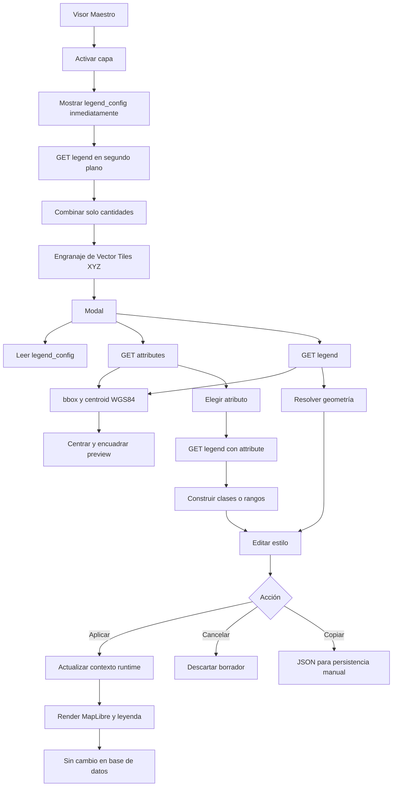

# Configuración de simbología para capas vectoriales en Visor Maestro

## Resumen

Se implementó en `sheets_map` un configurador temporal para capas Vector Tiles XYZ. Desde el engranaje de la capa, un administrador puede editar filtros, transparencia y simbología, aplicar el resultado al visor abierto y copiar el `legend_config` generado.

La funcionalidad **no persiste cambios en la base de datos**. El JSON copiado queda disponible para que un flujo administrativo posterior lo guarde manualmente en `legend_config`.

## Objetivo

Permitir que un administrador configure de manera visual:

- simbología simple para polígonos, líneas y puntos;
- simbología temática por categorías o rangos;
- colores, opacidades, bordes, tipo y ancho de línea;
- forma, tamaño y borde de puntos, con glifos visuales en el selector;
- nombres y colores de clases;
- título, descripción y visibilidad de la leyenda.
- vista previa reactiva incluso antes de seleccionar un atributo, sin generar una leyenda ficticia.
- selección de atributos sin mensajes transitorios de carga que desplacen el formulario; los errores continúan visibles.

## Contexto

El engranaje existente abría un popover orientado a filtros. Para las capas con código `operative_vector_tiles_xyz`, se reemplazó ese comportamiento por un modal con secciones separadas de **Filtros y transparencia** y **Simbología**. Los demás tipos de capa mantienen el popover anterior.

El formulario parte desde:

- `legend_config`, expuesto en la librería como `sh_map_has_layer_legend_config`;
- `gen_geoserver_layer`, expuesto como `sh_map_has_layer_geoserver_layer`;
- la URL de tiles, usada para derivar la base del servicio vectorial.

En el master local actual, el tipo XYZ reservado está configurado solo en el Visor Maestro. La librería todavía no recibe una prop que identifique el visor; por eso esta exclusividad es una precondición del host y no un UUID hardcodeado. Los permisos administrativos también permanecen bajo control de Sheets.

## Alcance

### Incluido

- Modal exclusivo para `operative_vector_tiles_xyz`.
- Lectura de configuración actual y edición sobre un borrador.
- Consulta de atributos, geometría, categorías y rangos.
- Simbología simple y temática.
- Aplicación temporal en MapLibre y en la leyenda visible.
- Apply/Cancel sin mutaciones de base de datos.
- Copia determinista de JSON con fallback manual y título inicial obtenido del nombre visible de la capa para evitar un bloqueo silencioso del botón.
- Validaciones de datos y protección contra respuestas asíncronas tardías.
- Contexto espacial WGS84 (`bbox` y `centroid`) en `attributes` y `legend`.
- Pruebas unitarias, compilación e integración local.
- Documentación técnica, PR y Jira.

### No incluido

- Guardado automático en `legend_config`.
- Migraciones o cambios de esquema.
- Cambios de permisos o autenticación.
- Cambios a otros endpoints o contratos del servicio vectorial.
- Corrección de deuda técnica heredada del build, lint o dependencias.

## Flujo completo

1. El administrador abre el Visor Maestro y activa una capa Vector Tiles XYZ. La capa aplica y muestra inmediatamente el `legend_config` incluido en **Mapa tiene Capas**. Después del primer render consulta la leyenda en segundo plano y añade únicamente las cantidades por clase entre paréntesis, sin ocultar ni reemplazar la leyenda visible.
2. Pulsa el engranaje de configuración.
3. El modal toma el `legend_config` actual y el `layer_name` configurado.
4. La librería consulta en paralelo los atributos y la leyenda sin atributo para resolver geometría.
5. Si se elige simbología temática, el usuario selecciona un atributo.
6. La librería consulta las clases o rangos correspondientes.
7. Antes de elegir un atributo, el administrador visualiza y modifica el estilo general que explica la apariencia inicial de la capa. Al seleccionar un atributo, esa configuración se reemplaza en la misma posición, antes de **Leyenda**, por **Estilo de la geometría** aplicado a las clases. Mientras el servicio responde, un espacio en blanco conserva la altura de la tarjeta y evita que **Leyenda** aparezca temporalmente en su lugar. La navegación anterior/siguiente utiliza flechas centradas y conserva los extremos inactivos sin cursor de bloqueo. Cada clase muestra primero su etiqueta y después controles separados en **Relleno**, **Borde**, **Marcador**, **Línea del borde** o **Línea** según la geometría; al deseleccionar el atributo, el estilo general reaparece.
8. **Aplicar en el visor** actualiza `working_layers → Vuex → SheetsMap → VectorTileLayer`.
9. MapLibre refleja el cambio en el mapa y la leyenda, solo en la sesión abierta.
10. **Cancelar** descarta el borrador no aplicado.
11. **Copiar JSON** se habilita al completar una configuración válida; en modo temático requiere seleccionar un atributo con clases o rangos. Incluye los estilos globales y por clase, usa Clipboard API con espera acotada o muestra el JSON seleccionable, y confirma **JSON copiado** durante 2 segundos mediante una píldora gris en la esquina inferior izquierda del pie del modal. El JSON excluye la transparencia y los filtros de sesión.
12. La persistencia, si se aprueba, se realiza manualmente fuera de este flujo.

## Diagrama Mermaid



## Funcionalidades implementadas

| Funcionalidad | Detalle |
| --- | --- |
| Gate de capa | Detecta `operative_vector_tiles_xyz` mediante aliases del modelo de capa. |
| Modal unificado | Separa **Simbología y leyenda** de **Filtros** mediante pestañas accesibles. |
| Vista previa | Usa MapLibre con `centroid` y `bbox` de la capa real, solicita solo tiles visibles y mantiene la misma leyenda del visor; ancho, opacidad y colores reaccionan al completar la selección. Los rangos con etiquetas redondeadas repetidas conservan estilos independientes y los elementos que no coinciden usan el color sin clasificación, no el azul general. Permanece alineada con el primer recuadro de configuración y fija en la parte superior de su columna durante el desplazamiento. |
| UX cartográfica | Incluye muestras de trazo, controles alineados, selectores de color visibles y checkboxes al final de sus grupos. |
| Límites de entrada | Impide valores fuera de rango tanto con flechas como mediante escritura de teclado. |
| Escalabilidad por clases | Usa una sola capa por geometría y expresiones `match`/`case`; cada feature se dibuja una vez. |
| Navegación de clases | Presenta una clase activa por vez mediante pestañas horizontales con muestra de color, acceso directo y botones anterior/siguiente; las flechas SVG quedan centradas, son grises en reposo, cambian a azul con hover o foco y no muestran texto emergente nativo. Un extremo inactivo no muestra cursor de bloqueo. |
| Contexto de edición | Mantiene el encabezado **Estilo de la geometría** tanto para la configuración general como para la edición específica por clases; al elegir un atributo reemplaza el bloque general en su misma posición antes de **Leyenda** y al quitarlo lo recupera. |
| Estabilidad durante la carga | Reserva un espacio en blanco hasta recibir las clases, sin mostrar controles ni bloques grises transitorios y evitando parpadeos o desplazamientos de **Leyenda**. |
| Organización por clase | Presenta **Etiqueta** como dato inicial independiente y separa los controles visuales en **Relleno**, **Borde**, **Marcador**, **Línea del borde** o **Línea**, según la geometría. |
| Responsive | El modal, las clases, el mapa y la leyenda se adaptan al viewport sin depender del zoom del navegador. La altura se recalcula tras los ajustes tardíos del encabezado CMS para impedir una franja blanca inferior; **Simbología y leyenda** usa casi toda la altura disponible y **Filtros** se ajusta a su contenido. Solo existe un scroll interno, sin gutter exterior; título y cierre permanecen centrados verticalmente y las acciones conservan separación inferior. |
| Espaciado | El bloque inferior del preview conserva el mismo margen que los laterales. |
| Contexto inicial | Rehidrata el editor desde `legend_config`. |
| Simbología simple | Configura un estilo único y su elemento de leyenda. |
| Categorías | Edita nombre, colores, opacidades, bordes, trazos y símbolos por clase. Cada override específico tiene prioridad sobre el estilo global. |
| Graduación | Edita mínimos, máximos, nombres y colores por rango. |
| Texto | Usa una clase editable para alta cardinalidad y acepta la clave legacy. |
| Geometrías | Aplica estilos de polígono, línea y punto. |
| Puntos | Admite círculo, cuadrado, triángulo y rombo; respeta íconos preconfigurados. |
| Líneas | Admite continua, segmentada y punteada. |
| Bordes de puntos | Selector visual para borde continuo, segmentado o punteado; las clases nuevas reciben un borde más oscuro que su relleno. |
| Leyenda | Muestra título, descripción, clases y clase sin clasificación. |
| Aplicación | Actualiza el mapa abierto sin persistencia. |
| Cancelación | Conserva el estado anterior. |
| Copia | Genera JSON estable, con timeout y fallback seleccionable. |
| Accesibilidad | Botón con etiqueta, feedback `aria-live` y JSON `readonly`. |

## Datos utilizados

| Dato | Fuente | Uso |
| --- | --- | --- |
| Tipo de capa | Mapa tiene Capas | Habilitar el modal. |
| `legend_config` | Mapa tiene Capas | Cargar la configuración vigente. |
| `gen_geoserver_layer` | Mapa tiene Capas | Resolver `layer_name`. |
| URL de tiles | Mapa tiene Capas | Derivar host/base y renderizar tiles. |
| Atributos | `GET /vector/layers/{layer_name}/attributes` | Completar selectores. |
| Geometría | `GET /vector/layers/{layer_name}/legend` | Mostrar controles apropiados. |
| Segmentación | `GET /vector/layers/{layer_name}/legend?attribute={attribute}` | Obtener categorías, rangos o texto. |
| `bbox` y `centroid` | Endpoints `attributes` y `legend` | Centrar y ajustar la cámara en EPSG:4326. |

Los endpoints efectivos usan `/vector/layers/` en plural. La validación real de APC con atributo `ciudad` devolvió `Point`, `categorical` y 10 clases.

## Input/Output con JSON

### Input exitoso: atributos

```json
{
  "layer_name": "apc",
  "attributes": [
    "ciudad",
    "categoria",
    "valor"
  ],
  "bbox": [-75.644, -53.162, -67.395, -18.478],
  "centroid": [-71.5195, -35.82]
}
```

### Input exitoso: segmentación categórica

```json
{
  "layer_name": "apc",
  "attribute": "ciudad",
  "legend_type": "categorical",
  "geometry_type": "Point",
  "classes": [
    {
      "key": "<valor_de_clase>",
      "label": "<etiqueta>",
      "count": 1
    }
  ],
  "bbox": [-75.644, -53.162, -67.395, -18.478],
  "centroid": [-71.5195, -35.82]
}
```

El `bbox` usa `[minX, minY, maxX, maxY]` y el `centroid` usa `[longitud, latitud]`, ambos en EPSG:4326. La vista previa centra primero la cámara y luego encuadra la extensión completa, cargando solo los tiles visibles y conservando una caché máxima de seis.

Para proteger capas pesadas, el servicio reutiliza la extensión persistida en `catalog_layers` y calcula `ST_Extent` únicamente como fallback si el catálogo no dispone de `bbox`.

### Output exitoso: configuración generada

```json
{
  "vector_tile_legend": {
    "attribute": "ciudad",
    "description": "Clasificación por ciudad",
    "enabled": true,
    "geometry_type": "Point",
    "layer_name": "apc",
    "legend_title": "APC por ciudad",
    "mode": "semantic",
    "palette": {
      "fallback_color": "#4E79A7",
      "items": {
        "<valor_de_clase>": {
          "fill": "#E15759",
          "label": "<nombre_visible>",
          "point": {
            "shape": "diamond",
            "size": 12,
            "stroke_width": 2
          },
          "stroke": "#8A3436",
          "style": {
            "border_enabled": true,
            "fill_opacity": 0.75,
            "stroke_opacity": 0.9
          }
        }
      },
      "name": "tableau10",
      "null_color": "#BDBDBD",
      "strategy": "manual",
      "type": "categorical"
    },
    "point_style": {
      "shape": "diamond",
      "size": 12,
      "stroke_width": 2
    },
    "ranges_continuous": false,
    "style": {
      "border_enabled": true,
      "dash_style": "solid",
      "fill_opacity": 0.6,
      "line_opacity": 0.85,
      "line_width": 2.5,
      "stroke_opacity": 0.8,
      "stroke_width": 2
    },
    "version": 2,
    "visibility": {
      "show_in_map_legend": true,
      "show_unclassified": true
    }
  }
}
```

### Error representativo

El endpoint `legend` de una capa inexistente respondió HTTP 404 con texto. La representación funcional en la UI es:

```json
{
  "status": "error",
  "error_code": "VECTOR_LAYER_NOT_FOUND",
  "message": "La capa no fue encontrada en el servicio vectorial."
}
```

Otros comportamientos contemplados:

- atributos inexistentes: HTTP 200 con `{"attributes":[]}`;
- atributo inválido: el servicio puede devolver la leyenda por defecto; la UI rechaza el resultado si `attribute` no coincide o no hay clases válidas.

## Formas de ejecución

### Preparación local

Usar Node.js 20, npm 10, Laravel Herd y PHP 8.1. No guardar credenciales en esta documentación.

```powershell
# En sheets_map
npm install --legacy-peer-deps
npm link
npm run build:lib

# En agcid01_datos_espaciales/sheets
npm link coderhubspa_sheets_map --legacy-peer-deps
npm run development -- --no-cache
```

La instalación local verificada expuso `node_modules/coderhubspa_sheets_map` como junction apuntando a `sheets_map`.

### Prueba manual

1. Abrir `https://agcid01-datos-espaciales.test/entity/gen_visor_maestro`.
2. Ingresar con un administrador.
3. Activar APC y abrir su engranaje.
4. Seleccionar simbología temática y atributo `ciudad`.
5. Confirmar 10 clases y controles de geometría de punto.
6. Confirmar que el preview se centre y encuadre automáticamente sin modificar el zoom manualmente.
7. Cambiar una etiqueta, color y forma.
8. Aplicar y verificar mapa más leyenda.
9. Reabrir, modificar y cancelar; verificar que no cambia el estilo.
10. Copiar JSON y pegarlo en un editor. Si falla, usar el JSON visible y seleccionable.
10. Confirmar en Network que no hubo `POST`, `PUT`, `PATCH` ni `DELETE`.
11. Recargar; el estilo debe volver al persistido originalmente.

### Validaciones técnicas

```powershell
# En sheets_map
npm test
npm run build:lib

# En Sheets
npm run development -- --no-cache
```

## Casos representativos

| Caso | Evidencia |
| --- | --- |
| Unitarios de contrato, render y UX | `sheets_map`: 43/43, incluidos conteos progresivos, rangos repetidos y fallback sin clasificación; `ch_geoserver_v2`: 24/24 dirigidos. |
| Cypress local de layout | 1/1: altura completa del mapa, desplazamiento del modal y espaciado de encabezado/footer. |
| Suite completa `ch_geoserver_v2` | 961 correctos; 81 fallos de baseline ajenos al cambio en OGC WFS/settings. |
| Simbología simple | Contrato parseable y render simple cubiertos. |
| Categorías de puntos | APC `ciudad`: `Point`, 10 clases, GETs correctos. |
| Rangos numéricos | Límites editables y expresiones `case` cubiertos. |
| Formas de punto | Simple, categórica, numérica y texto cubiertas. |
| Filtros | URL inicial y query params existentes cubiertos. |
| Apply/Cancel | Cypress 1/1 correcto. |
| Preview MapLibre | La cobertura valida fuente real, caché acotada, `bbox`/`centroid`, fallback y reactividad; queda repetir Cypress con el API desplegado. |
| Persistencia accidental | 0 métodos mutantes observados. |
| Reapertura/cancelación | Estado runtime validado. |
| Clipboard | JSON exacto, parseable, timeout y fallback cubiertos por unitarios. |
| Builds | `build:lib` y build Sheets sin caché correctos. |
| Sitio | HTTP 200. |

La copia automática no se evalúa mediante Cypress/Electron porque ese navegador puede dejar pendiente la Clipboard API. La validación manual en Chrome fue correcta y el JSON completo pudo pegarse en Word.

La validación visual de centrado y encuadre espacial también queda pendiente hasta desplegar `agcid01_geoserver`: el Visor Maestro local apunta al servicio remoto y no puede consumir directamente el backend modificado en el workspace.

## Pendientes

- [x] Verificar manualmente la copia automática en Chrome y pegar el JSON en Word.
- [ ] Copiar y persistir un `legend_config` aprobado mediante el flujo administrativo correspondiente.
- [ ] Incorporar una capability explícita si el tipo XYZ se habilita en otros visores.
- [ ] Declarar/corregir la dependencia directa de Turf de Sheets en otra tarea.
- [ ] Abordar en tareas separadas 52 vulnerabilidades npm, warnings de build y baseline de lint.

Warnings conocidos sin cambio de alcance:

- `bootstrap-vue` (`PURE`) y `vue2-leaflet`;
- deprecaciones Sass;
- bundles grandes;
- lint global bloqueado por Babel y cuatro hallazgos heredados en `SheetsMap.vue`.

El lint dirigido quedó bloqueado antes de analizar reglas porque `@babel/eslint-parser` exige una configuración Babel inexistente. El wrapper y Sheets quedaron limpios; no se realizaron commits.

## Criterios de aceptación

- [x] El engranaje abre el modal para `operative_vector_tiles_xyz`.
- [x] Los demás tipos conservan el popover existente.
- [x] El modal separa filtros/transparencia y simbología; el deslizador usa una columna y el atributo se muestra debajo, junto al valor del filtro.
- [x] La configuración parte desde `legend_config` y `gen_geoserver_layer`.
- [x] Al activar una capa, la leyenda persistida aparece primero y los conteos se incorporan después sin parpadeos ni estados vacíos.
- [x] Los atributos se obtienen desde el endpoint plural correspondiente.
- [x] La leyenda semántica se obtiene por atributo.
- [x] `attributes` y `legend` entregan `bbox` y `centroid` WGS84 para el preview.
- [x] La vista previa centra y encuadra capas dispersas sin depender de features cargadas por azar.
- [x] Se soporta simbología simple.
- [x] Se soportan categorías y rangos numéricos.
- [x] Se soportan polígonos, líneas y puntos.
- [x] Se pueden editar colores, opacidad, bordes, líneas, nombres y descripción.
- [x] **Estilo de la geometría** separa Relleno, Borde y Marcador/Línea según la geometría, sin duplicar anchos de borde.
- [x] Los puntos admiten forma y tamaño inicial `3`; una forma no circular oculta completamente el círculo alternativo, incluido su contorno.
- [x] Aplicar modifica únicamente el contexto actual.
- [x] Cancelar no modifica el estado aplicado.
- [x] Se genera JSON determinista y parseable.
- [x] Existe fallback visible cuando el portapapeles falla.
- [x] No se modifica la base de datos durante el flujo.
- [x] Los 43 tests unitarios de `sheets_map`, las 24 pruebas dirigidas de `ch_geoserver_v2`, el Cypress dirigido de layout y ambos builds finalizaron correctamente.
- [x] El flujo Apply/Cancel pasó en Cypress.
- [x] La copia automática está confirmada manualmente en Chrome.


