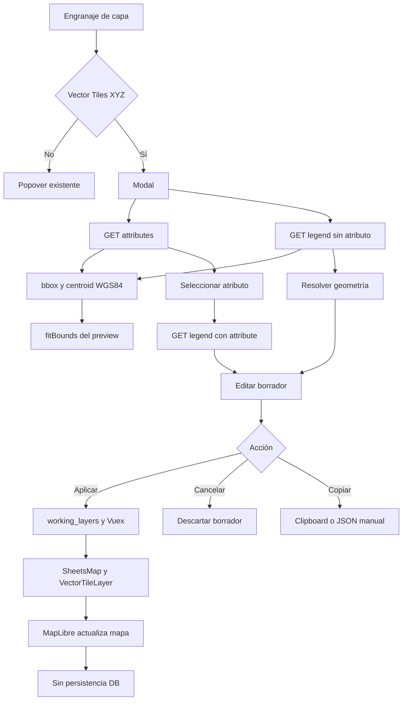

# Feat: configurar simbología temporal de Vector Tiles XYZ

## Resumen

Incorpora un modal de configuración para capas `operative_vector_tiles_xyz` que reúne filtros, transparencia y simbología. El administrador puede aplicar el estilo al contexto abierto del Visor Maestro y copiar el `legend_config` generado, sin persistencia automática ni cambios en la base de datos.

La solución consume los endpoints plurales de atributos y leyenda, ahora enriquecidos con `bbox` y `centroid` en EPSG:4326, respeta la configuración inicial de la capa y traduce el borrador a estilos MapLibre para polígonos, líneas y puntos.

### Orden de revisión recomendado

1. Revisar contrato, validación y serialización en `src/utils/vectorTileLegend/editor.js`.
2. Revisar orquestación del modal y manejo de errores en `VectorTileLayerSettingsModal.vue`.
3. Revisar propagación runtime en `SheetsMapTools.vue`, `SheetsMap.vue` y `VectorTileLayer.vue`.
4. Revisar expresiones de estilo, símbolos y compatibilidad en `vectorTileLegend/style.js`.
5. Revisar el contrato espacial en `ch_geoserver_v2/src/vector/` y su consumo en `VectorTileSymbologyPreview.vue`.
6. Revisar los casos automatizados y esta documentación.

### Fuera de alcance

- Persistir automáticamente en `legend_config`.
- Modificar migraciones, modelo de datos o permisos del host.
- Cambiar el comportamiento de tipos de capa distintos de Vector Tiles XYZ.
- Corregir warnings, vulnerabilidades o lint heredados.
- Hardcodear un UUID para identificar el Visor Maestro.

## Archivos modificados

| Archivo | Cambio |
| --- | --- |
| `package.json` | Agrega el comando `npm test` con el runner nativo de Node. |
| `src/components/SheetsMap.vue` | Inyecta el `legend_config` temporal y una revisión en las capas renderizables. |
| `src/components/SheetsMapTools.vue` | Reemplaza el engranaje de Vector Tiles XYZ por el modal y conserva estado runtime por capa. |
| `src/components/VectorTileLayerSettingsModal.vue` | Implementa carga, validación, Apply/Cancel y copia de JSON. |
| `src/components/VectorTileSymbologyEditor.vue` | Implementa el formulario modular de simbología. |
| `src/components/VectorTileSymbologyPreview.vue` | Centra y encuadra la capa mediante `centroid` y `bbox`, con fallback compatible. |
| `src/components/layers/VectorTileLayer.vue` | Aplica filtros, estilos, símbolos y actualizaciones asíncronas seguras. |
| `src/components/layers/VectorTileLegend.vue` | Muestra descripción y representación de líneas segmentadas o punteadas. |
| `src/services/vectorTileAttributesService.js` | Permite cancelar el GET de atributos mediante `AbortSignal`. |
| `src/services/vectorTileLegendService.js` | Permite cancelar el GET de leyenda mediante `AbortSignal`. |
| `src/utils/clipboard.js` | Agrega timeout, fallback de copia y feedback accesible. |
| `src/utils/vectorTileLegend/canvas.js` | Normaliza el ancho de borde en íconos generados por canvas. |
| `src/utils/vectorTileLegend/config.js` | Normaliza el contrato v2, objetos ya parseados, estilos y rangos. |
| `src/utils/vectorTileLegend/constants.js` | Centraliza claves de texto actuales y legacy. |
| `src/utils/vectorTileLegend/editor.js` | Crea, valida y serializa el borrador determinista. |
| `src/utils/vectorTileLegend/icon.js` | Construye y parsea expresiones de símbolos para puntos. |
| `src/utils/vectorTileLegend/style.js` | Genera estilos simples y temáticos para todas las geometrías soportadas. |
| `src/utils/vectorTileLegend/preview.js` | Normaliza el contexto espacial WGS84 y construye el render state de preview. |
| `src/utils/vectorTileUrl.js` | Construye URLs de tiles con filtro sin perder query params previos. |
| `tests/vectorTileLegendEditor.test.js` | Cubre contrato, render, rangos, filtros, símbolos, clipboard y layout. |
| `docs/configuracion-simbologia-vector-tiles.md` | Documentación técnica y guía de pruebas. |
| `docs/pr/configuracion-simbologia-vector-tiles.md` | Descripción de PR. |
| `docs/jira/configuracion-simbologia-vector-tiles.md` | Resumen y evidencias para Jira. |
| `ch_geoserver_v2/src/vector/...` | Extiende modelos, servicio, repositorio PostGIS y endpoints con `bbox`/`centroid`. |
| `ch_geoserver_v2/tests/...` | Verifica el contrato espacial en router, servicio y repositorio. |

## Descripción detallada

### Experiencia de edición

El modal se organiza en las pestañas **Simbología y leyenda** y **Filtros**. La primera incorpora un mapa MapLibre que toma `centroid` como centro inicial y ajusta la cámara al `bbox` completo de la capa. Así APC y otras capas dispersas aparecen en pantalla sin exigir zoom manual. Solo se solicitan los tiles visibles del encuadre y la caché se limita a seis tiles; el fallback antiguo inspecciona como máximo 200 features ya cargadas. `VectorTileLegend` conserva el mismo formato de la leyenda final. El panel agrega separación inferior uniforme, no muestra notas técnicas debajo del mapa ni mensajes transitorios al cargar la clasificación de un atributo, e incluye trazos visuales, límites efectivos y colores accesibles. Las clases usan pestañas horizontales con muestra de color y botones anterior/siguiente para evitar un scroll vertical extenso; sus flechas SVG quedan centradas, aparecen grises en reposo, cambian a azul con hover o foco y no incluyen `title` nativo. Los extremos inactivos no muestran cursor de bloqueo. La tarjeta mantiene el contexto **Estilo de la geometría**, reemplaza al estilo general en su misma posición antes de **Leyenda** y conserva un espacio en blanco mientras llegan las clases, evitando tanto indicadores grises transitorios como el salto visual de la tarjeta de leyenda. Luego presenta **Etiqueta** como campo inicial independiente y organiza los controles por **Relleno**, **Borde**, **Marcador**, **Línea del borde** o **Línea** según corresponda. En **Filtros**, el deslizador de transparencia ocupa una columna y la fila siguiente alinea el atributo junto al valor del filtro. El mapa recalcula y estabiliza su altura después de los cambios tardíos del layout CMS para evitar una zona blanca inferior. El modal mantiene un solo scroll interno visible y desplazable, sin dejar el gutter de una barra exterior; **Simbología y leyenda** ocupa casi toda la altura disponible y **Filtros** recupera una altura compacta ajustada a su contenido. La cabecera mantiene el título y la X centrados verticalmente al cambiar el tamaño del viewport, y los tres botones conservan separación inferior.

### Elegibilidad y contexto

El modal solo se habilita cuando `sh_map_has_layer_code` o su alias local `code` es `operative_vector_tiles_xyz`. La configuración inicial se obtiene desde:

- `sh_map_has_layer_legend_config`, alias de `legend_config`;
- `sh_map_has_layer_geoserver_layer`, alias de `gen_geoserver_layer`;
- URL de tiles como respaldo para inferir `layer_name` y construir la base de API.

La librería no recibe una identidad del visor. En el master local, el tipo reservado está configurado únicamente en el Visor Maestro; esa es la precondición que mantiene el alcance solicitado. Los permisos de administración siguen bajo control del host.

### Editor y contrato

El editor trabaja sobre un borrador desacoplado. Permite:

- simbología simple o temática;
- categorías, rangos numéricos y texto de alta cardinalidad;
- colores, nombres, opacidades, bordes, trazos y símbolos por clase;
- líneas y bordes de marcadores continuos, segmentados o punteados;
- formas, tamaños y bordes para puntos;
- borde continuo, segmentado o punteado para puntos, con muestra visual y color inicial contrastante derivado del relleno;
- título, descripción y clase sin clasificación.

La serialización produce `vector_tile_legend.version = 2`, ordena recursivamente las claves y mantiene compatibilidad con `colors` y `__TEXT_FALLBACK__` legacy.

### Aplicación temporal

Al aplicar, `SheetsMapTools` actualiza transparencia, filtro, `runtimeLegendConfigs` y `legendRevision`. El estado viaja por `working_layers → Vuex → SheetsMap → VectorTileLayer`. MapLibre actualiza el estilo y la leyenda sin enviar mutaciones al servidor. Al activar posteriormente una capa, `VectorTileLayer` reconstruye estilos y clases directamente desde el `legend_config` recibido y los presenta de inmediato. Después del primer render consulta `/legend?attribute=...` en segundo plano para incorporar exclusivamente las cantidades entre paréntesis; mantiene las etiquetas y estilos persistidos, descarta respuestas obsoletas y conserva la leyenda visible ante errores.

Al cancelar, el modal descarta el borrador y no emite `apply`. Solicitudes anteriores se abortan o descartan para evitar que una respuesta tardía sobrescriba el atributo actual.

El preview utiliza el mismo serializador, normalizador y constructor de render state que la capa productiva. También reacciona antes de elegir un atributo mediante un estilo simple transitorio sin crear una leyenda ficticia. **Estilo de la geometría** agrupa los controles generales en **Relleno**, **Borde** y, según corresponda, **Marcador**, **Línea del borde** o **Línea** mientras no exista un atributo seleccionado. Al seleccionar uno, la configuración general se reemplaza en el mismo punto del flujo, antes de **Leyenda**, por una tarjeta específica que conserva el encabezado y presenta las pestañas de clases. Dentro de cada clase, **Etiqueta** queda separada de las subsecciones visuales, que repiten la organización semántica por geometría; al deseleccionar el atributo reaparece el bloque general. Las clases parten de la configuración global y cada propiedad personalizada se serializa como override con prioridad. Los rangos numéricos reciben claves internas únicas incluso cuando sus etiquetas redondeadas coinciden, evitando que un color sobrescriba a otra clase. Cualquier valor nulo o fuera de rango usa el color sin clasificación, o se oculta cuando dicha visibilidad está desactivada. El tamaño inicial de puntos es `3` y no se duplica el ancho de borde. Las formas no circulares apagan tanto el relleno como el contorno de la capa `circle`, evitando símbolos superpuestos. Los selectores usan espaciado consistente, tipografía uniforme y glifos negros para las formas de punto. Para escalar con muchas clases, mantiene una capa de datos por alternativa de representación y resuelve estilos con expresiones `match`/`case`; no replica features ni genera una capa por categoría.

El API reutiliza primero `catalog_layers.bbox`, ya persistido en WGS84, y deja `ST_Extent` como fallback exacto cuando el catálogo no contiene extensión. Esto evita recalcular el alcance de capas pesadas en cada consulta normal.

### Copia segura

La copia usa Clipboard API con timeout de 1200 ms y luego un `textarea` temporal. Si ambos mecanismos fallan, muestra el JSON completo en un control `readonly` y seleccionable. Cuando la copia finaliza, muestra **JSON copiado** durante 2 segundos en una píldora gris ubicada en la esquina inferior izquierda del pie del modal.

## Flujo funcional

1. El administrador abre el engranaje de una capa.
2. La librería verifica `operative_vector_tiles_xyz`.
3. El modal toma el `legend_config` actual y el `layer_name` configurado.
4. Carga atributos y geometría en paralelo.
5. Al elegir un atributo, consulta sus clases o rangos.
6. El usuario edita y valida el borrador.
7. **Aplicar en el visor** actualiza solo el contexto runtime.
8. **Cancelar** descarta los cambios no aplicados.
9. El título se inicializa desde el nombre visible de la capa y **Copiar JSON** se habilita cuando la configuración está completa; en modo temático esto exige un atributo con clases o rangos. El contenido incluye todos los estilos globales y por clase, y la interfaz informa únicamente el resultado final de la copia.

## Diagrama Mermaid



## Datos utilizados

| Dato | Origen | Uso |
| --- | --- | --- |
| Código de tipo | Mapa tiene Capas | Gate `operative_vector_tiles_xyz`. |
| `legend_config` | Mapa tiene Capas | Estado inicial del editor. |
| `gen_geoserver_layer` | Mapa tiene Capas | `layer_name` para API y contrato. |
| URL de tiles | Mapa tiene Capas | Base de endpoints y fuente MapLibre. |
| Atributos | `GET /vector/layers/{layer_name}/attributes` | Selector temático y filtro. |
| Geometría y clases | `GET /vector/layers/{layer_name}/legend` | Tipo de controles y estado inicial. |
| Segmentación | `GET /vector/layers/{layer_name}/legend?attribute=...` | Categorías, rangos o texto. |
| `bbox` | `attributes` y `legend` | Ajustar el mapa a la extensión WGS84 de la capa. |
| `centroid` | `attributes` y `legend` | Inicializar el centro del preview en longitud/latitud. |

La integración real validada con APC y `ciudad` informó geometría `Point`, segmentación `categorical` y 10 clases.

## Contrato input/output

### Input exitoso representativo

```json
{
  "sh_map_has_layer_code": "operative_vector_tiles_xyz",
  "sh_map_has_layer_geoserver_layer": "apc",
  "sh_map_has_layer_legend_config": "{\"vector_tile_legend\":{\"enabled\":true}}",
  "sh_map_has_layer_url": "/vector/tiles/apc/{z}/{x}/{y}.pbf"
}
```

### Output exitoso representativo

Los endpoints vectoriales agregan contexto espacial sin cambiar sus campos anteriores:

```json
{
  "layer_name": "apc",
  "attributes": ["ciudad", "n_eventos"],
  "bbox": [-75.644, -53.162, -67.395, -18.478],
  "centroid": [-71.5195, -35.82]
}
```

```json
{
  "layerKey": 7,
  "opacity": 0.8,
  "filterAttribute": "ciudad",
  "filterValue": "<valor>",
  "legendConfig": "{\"vector_tile_legend\":{\"version\":2,\"mode\":\"semantic\",\"layer_name\":\"apc\",\"attribute\":\"ciudad\"}}"
}
```

`legendConfig` es texto JSON y se aplica solo al estado runtime.

### Error representativo

El endpoint de una capa inexistente responde HTTP 404 con texto. La UI lo presenta de forma equivalente a:

```json
{
  "status": "error",
  "error_code": "VECTOR_LAYER_NOT_FOUND",
  "message": "La capa no fue encontrada en el servicio vectorial."
}
```

Si `attributes` responde HTTP 200 con `{"attributes":[]}`, se informa que la capa no expone atributos. Si un atributo inválido devuelve la leyenda por defecto, el cliente rechaza el payload porque el atributo retornado no coincide.

## Reglas de negocio

- Solo `operative_vector_tiles_xyz` usa el nuevo modal.
- Otras capas conservan el popover existente.
- La simbología temática requiere atributo y clases válidas.
- Los rangos deben ser numéricos, ordenados, sin solapamientos y sin huecos cuando son continuos.
- La forma de punto se deshabilita si ya existe un ícono configurado, porque el ícono tiene prioridad.
- Aplicar modifica solo la sesión abierta.
- Cancelar no modifica el estilo aplicado.
- Copiar no persiste; entrega el JSON para una operación administrativa manual.
- No se envían métodos HTTP mutantes durante este flujo.

## Casos representativos

| Caso | Resultado esperado | Estado |
| --- | --- | --- |
| Simbología simple de polígono | Relleno, borde y leyenda se actualizan en runtime. | Cubierto por unitarios. |
| Categoría de puntos | Colores y formas por clase generan símbolos MapLibre. | Cubierto y validado con APC. |
| Graduación de líneas | Rangos editados generan expresiones `case` y patrón de línea. | Cubierto por unitarios. |
| Texto de alta cardinalidad | Usa una clase editable y acepta clave legacy. | Cubierto por unitarios. |
| Filtro con query previa | Agrega `&filter...` sin perder parámetros. | Cubierto por unitarios. |
| Cancelar tras editar | Conserva el estado anterior. | Cypress 1/1 correcto. |
| Aplicar configuración | Reabre con el estado runtime y sin mutaciones HTTP. | Cypress 1/1 correcto. |
| Copia JSON en Chrome | Copia la configuración completa y permite pegarla en Word. | Validación manual correcta. |
| Clipboard bloqueado | Muestra JSON `readonly` y seleccionable. | Cubierto por unitarios. |

## Riesgos

- El alcance por visor depende actualmente de la reserva del tipo XYZ; falta una capability explícita del host.
- Cypress/Electron puede bloquear o dejar pendiente la Clipboard API.
- Sheets tiene una dependencia directa de Turf ausente en el entorno; la prueba local se resolvió mediante la junction.
- El build conserva warnings de `bootstrap-vue`, `vue2-leaflet`, Sass y bundles grandes.
- La suite completa de `ch_geoserver_v2` conserva 81 fallos de baseline ajenos al cambio (OGC WFS no registrado y un default de settings); las 24 pruebas dirigidas pasan.
- `npm` reporta 52 vulnerabilidades existentes, no corregidas en este cambio.
- El lint global y el dirigido quedan bloqueados antes de analizar reglas porque `@babel/eslint-parser` exige una configuración Babel inexistente; este baseline no fue introducido por el cambio.

## Pendientes

- [x] Validar manualmente **Copiar JSON** en Chrome y pegar el resultado en Word.
- [ ] Definir una capability explícita si Vector Tiles XYZ se habilita fuera del Visor Maestro.
- [ ] Tratar la dependencia directa de Turf de Sheets en una tarea separada.
- [ ] Resolver warnings, vulnerabilidades y baseline de lint en cambios independientes.
- [ ] Persistir manualmente un JSON aprobado en `legend_config`, fuera de esta PR.

## Referencias

- URL local de prueba: `https://agcid01-datos-espaciales.test/entity/gen_visor_maestro`.
- Comandos verificados: `npm test`, `npm run build:lib`, `npm run development -- --no-cache`.
- Resultado verificado: 43/43 unitarios en `sheets_map`, 24/24 pruebas dirigidas en `ch_geoserver_v2` y 1/1 Cypress local de layout; el mapa llega al borde inferior, el scroll interno funciona y el encabezado/footer mantienen su espaciado. El enriquecimiento progresivo conserva etiquetas y estilos, relaciona rangos por límites, mantiene independientes los rangos con etiquetas repetidas y aplica el fallback sin clasificación. Queda repetir la validación espacial de `bbox`/`centroid` con el API desplegado.
- La revisión visual local de `bbox`/`centroid` no es posible antes de ese despliegue porque el Visor Maestro local consume el servicio remoto, no el backend modificado en el workspace.
- El wrapper y Sheets quedaron sin cambios versionados después de la integración local; la implementación pertenece a `sheets_map`.


